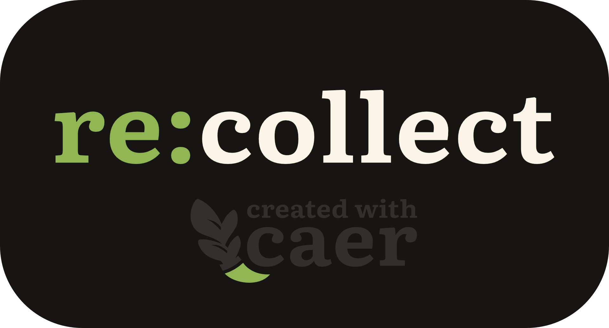

[@caer](https://github.com/caer)'s Ludum Dare #58 submission.

> In a world without sound, play as Recco, and gather lost
> records of music from a civilization long since past.

## License and Contributions

### Audio Assets

Audio samples are by:

- [Helton Yan](https://heltonyan.itch.io/tranquility)
- [Clark Audio](https://clarkaudio.com/)
- [bfxr](https://www.bfxr.net/)

Copyright their respective owners.

### Art Assets and Game Code

Art assets and game code are copyright
2025 With Caer, LLC, all rights reserved.

### Everything Else

All other content in this repository is copyright 2025 With Caer, LLC.

Licensed under the Functional Source License, Version 1.1, MIT Future License.
Refer to [the license file](LICENSE.md) for more info.
